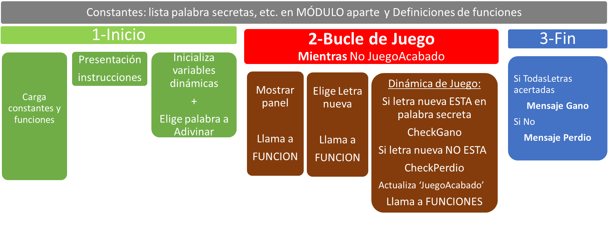
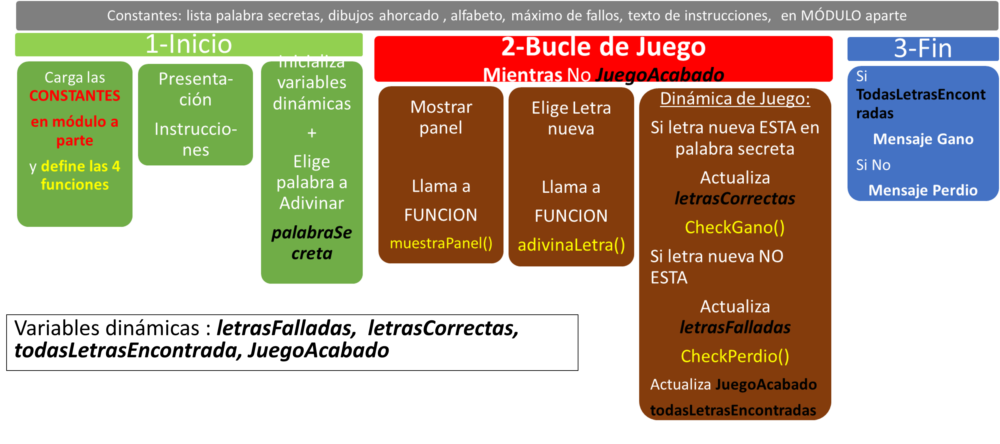
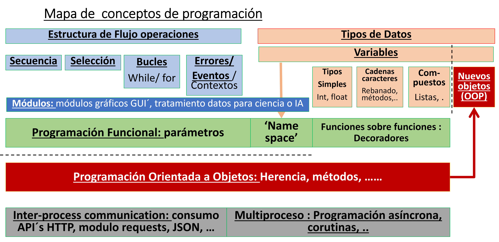

# CL9 - Python : 'Ahorcado' : 1er programa complejo - Listas y módulos - PyR 2024_25 CMM BML

Forma parte de la serie '**Workshop about Python and micropython with Pico W in CMM Benito**' Martin Madrid

## Clase 9 - Indice - 90 minutos

- Módulos: ¿Por qué? Ventajas

- Diseño del ‘Ahorcado’: bloques en seudocódigo

- ESTUDIAR y PROBAR:   “AhorcadoSimple” + mejoras 1 y 2

## Tutoriales y Programas que vamos a seguir

### Tutoriales resumen

Del libro 'Invent with Python ..."'

[Chapter 7 - Designing Hangman with Flowcharts](https://inventwithpython.com/invent4thed/chapter7.html)

[Chapter 8 - Writing the Hangman Code](https://inventwithpython.com/invent4thed/chapter8.html)

----

### Tabla resumen de programas

| Programa                                     | Lenguaje | Objetivo de Aprendizaje                                                            |
| -------------------------------------------- | -------- | ---------------------------------------------------------------------------------- |
| [P_ahorcadoListas.py](P_ahorcadoListas.py)   | Py       |                                                                                    |
| [P_ahorcado_Simple.py](P_ahorcado_Simple.py) | Py       | Versión funcional pero simple del ahorcado + necesita importar P_ahorcadoListas.py |
| [P_ahorcado_Mej1.py](P_ahorcado_Mej1.py)     | Py       | reemplaza rayas con las letras correctas en su posición                            |
| [P_ahorcado_Mej1y2.py](P_ahorcado_Mej1y2.py) | Py       | Expande letras falladas y correctas con 1 caracter + por cada letra                |

### Recomendaciones de estudio despues de la clase

Leer Libro de python:

[Modulos](https://ellibrodepython.com/modulos-python#m%C3%B3dulos-en-python)

Nota : [explicar   ` __main__ ` ](https://ellibrodepython.com/modulos-python#m%C3%B3dulos-y-funci%C3%B3n-main)

En los pdfs CL9 y especialmente en el de **CL10** hay información complementaria sobre cadenas , f-strings y listas, que servirá para entender partes de los programas

## Módulos: ¿Por qué? Ventajas

Los módulos en Python son una de sus características más poderosas
y versátiles, son simplemente ficheros separados que se ejecutan junto a otros

* **Organización:**

Los módulos permiten organizar el código en unidades más pequeñas, lo que mejora la legibilidad y facilita la colaboración entre desarrolladores.

* **Reusabilidad:**

Permiten agrupar funciones, clases o bloques de código relacionados en el mismo archivo.
En lugar de copiar sus definiciones en varios programas, podemos definir
nuestras funciones más utilizadas en un módulo e importarlo.

* **Mantenibilidad:**

Al separar el código en módulos, es más sencillo realizar cambios, mejoras o correcciones en áreas específicas sin afectar el resto del programa.

Por razones didácticas, vamos a separar parte del programa del Ahorcado

[P_ahorcado_Simple.py](P_ahorcado_Simple.py)

en un modulo aparte :

[P_ahorcadoListas.py](P_ahorcadoListas.py)

para entender como funcionan los módulos y sus ventajas. 

Los 2 programas con mejoras de Ahorcado_simple, 

[P_ahorcado_Mej1.py](P_ahorcado_Mej1.py)

[P_ahorcado_Mej1y2.py](P_ahorcado_Mej1y2.py)

también requerirán importar el modulo

## Diseño del ‘Ahorcado’: bloques en seudocódigo



## Estudiar y probar:   “AhorcadoSimple” + mejoras 1 y 2

### Modulo : P_ahorcadoListas.py

Aqui vamos a incluir :

* Dibujos del ahorcado como lista

* Lista de palabras secretas -> ver uso de [split](https://ellibrodepython.com/cadenas-python#splitsepnone-maxsplit-1)

* Alfabeto : letras que se consideran validas. En una primera versión no se utilizaran acentos

* Mensaje de presentación

Hemos separado estas partes en el modulo más por aprender que porque sea útil en un programa pequeño como este. Sin embargo es util poder ampliar las palabra secretas que el jugador ha de adivinar, **sin tener que tocar el programa principal**

### Programa Principal (sin mejoras) : P_ahorcado_simple.py

Veamos un diagrama de seudocódigo con más detalle



El programa en Python incluye comentarios que siguen los bloques de seudocódigo, por ejemplo

```
# 1.2 Inicializacion de variables de juego
letrasFalladas = ''
letrasCorrectas = ''
JuegoAcabado = False
```

que se corresponden con un bloque de 1-INICIO

Se explicará en la clase cada bloque, pero antes conviene estudiar el concepto de programación funcional

### Programación Funcional

ver del libro de Python [Funciones](https://ellibrodepython.com/funciones-en-python)

### Partes de Principal : P_ahorcado_simple.py

#### Inicio

```
# BLOQUE de juego 1 - INICIALIZACION
# 1.1 presentacion de Juego
print(f'Programa del ahorcado Clase 9 - Version {VERSION}')
print(MENS_PRESENTA)

# 1.2 Inicializacion de variables de juego
letrasFalladas = ''
letrasCorrectas = ''
JuegoAcabado = False
todasLetrasEncontradas = False

# 1.3 Eleccion de la palabra a adivinar
IndiceAleatorio = randint(0, len(PALABRAS) - 1)
palabraSecreta = PALABRAS[IndiceAleatorio] # eleccion de la palabra a adivinar
```

1.1 es auto explicativo

1.2 : es la inicialización de las variables de juego. Las cuestiones aqui serian:

    a) Porque esas variables y no otras ==> se intenta usar el menor numero posible de variables de juego y a su vez que por ahorrarse una variables las manipulaciones se conviertan en mucho mas complejas

    b) porque usar esos tipos : cadena y booleana

        Para guardar letras, cadena, es el tipo mas sencillo. Solo vamos a necesitar comprobar que las letras nuevas estan en las ya adivinadas o las ya falladas ( entre otras cosas) . Con el tipo cadena esto es facil

        La variable booleana `JuegoAcabado `servirá para finalizar el bucle de juego, asi que es el tipo adecuado

        La variable booleana `todasLetrasEncontradas` servirá para la selección del Final : gano, / perdió. Hay un caso de fallar todas las letras que podria dar error si no se inicializa

1.3 Hay que escoger de forma aleatoria un apalabra entre las de la lista ` PALABRAS`. Ya conocemos como generar enteros aleatorios, asi que por no complicarnos con cosas nuevas, se usa este entero aleatorio como indice de la lista. Hay otra manera usando un metodo no explicado del modulo random : `random.choice(PALABRAS)`

#### 2- Bucle de Juego

```
# 2- BUCLE PRINCIPAL DE JUEGO
while not JuegoAcabado:
    # Paso 2.1 - Muestra panel de situacion: dibujo del ahorcado, y aciertos
    print('----------------------- Nuevo Intento -----------------------')
    muestraPanel(letrasFalladas, letrasCorrectas, palabraSecreta)

    # Paso 2.2 - El jugador debe proponer una letra distinta a las ya dichas
    propuesta = adivinaLetra(letrasFalladas + letrasCorrectas)

    # Paso 2.3 - Dinamica de juego -> Comprueba si letra propuesta esta en palabra a adivinar
    if propuesta in palabraSecreta:
        # Paso 2.3.A si letra propuesta esta en palabra secreta
        letrasCorrectas = letrasCorrectas + propuesta

        # Chequea si el jugador ha ganado       
        todasLetrasEncontradas = CheckGano(palabraSecreta, letrasCorrectas)

        JuegoAcabado = todasLetrasEncontradas               

    else: # Paso 2.3.B NO esta
        letrasFalladas = letrasFalladas + propuesta
        # Paso 2.3.B.2 Chequea si el jugador ha pasado su numero de fallos
        JuegoAcabado = CheckPerdio(letrasFalladas, MAXFALLOS)
```

Se ha hecho una abstracción con las funciones:

- muestraPanel() : Muestra panel de situacion: dibujo del ahorcado, y aciertos. En esta funcion haremos las mejoras 1 y 2

- adivinaLetra() : devuelve la letra nueva elegida por el jugador. Se encarga de comprobar que se a nueva y que este en el alfabeto

- CheckGano()

- CheckPerdio()
  
  y asi el bucle de juego se ve como simple y auto explicativo

#### 3-FIN

```
# Bloque 3 FIN DEL JUEGO
#3.1 Muestara ultimo panel
print('===================== FIN DE JUEGO =====================')
muestraPanel(letrasFalladas, letrasCorrectas, palabraSecreta)
# 3.2 Mensajes de Ganar o Perder
if todasLetrasEncontradas:
    print('¡Si! La palabra secreta es "' + palabraSecreta + '"¡Has ganado!')
else:
    print('¡Has agotado todos los intentos!')
    print('Despues de fallar ' + str(len(letrasFalladas)) + ' veces y acertar ' + str(len(letrasCorrectas)) + ' veces. La palabra era "' + palabraSecreta + '"')
# FIN DE PROGRAMA
```

Muestra una ultima vez el panel de juego. Selección de si ganó o perdió en función del valor de `todasLetrasEncontradas` y mostrar los mensaje correspondientes 

### Programa : P_ahorcado_Mej1.py -> Cambios

El cambio solo afecta a muestraPanel(), y se ha hecho de forma que no cambian los parámetros:  lo que va entre paréntesis en la llamada a la funcion, con lo que el resto del programa no tiene que ser cambiado

Mej1  reemplaza rayas con las letras correctas en su posición

Veamos el cambio hecho en muestraPanel()

```
# info de letras acertadas
    huecosPsec = len(palabraSec)
    huecosXrayas = '-' * huecosPsec
    for i in range(len(palabraSec)): # Mej 1: reemplaza rayas con las letras correctas en su posicion
        if palabraSec[i] in letrasCorr:
            huecosXrayas = huecosXrayas[:i] + palabraSecreta[i] + huecosXrayas[i+1:]
```

La variable `letrasCorr` guarda las letras acertadas pero no guarda información del orden en el que estan en la palabra secreta, asi que hay que recorrer la palabra secreta con indices para cambiar ese lugar acertado con la letra acertada en la cadena `huecosXrayas`.Para enteder como se hace repasar el rebanado de cadenas

### Programa : P_ahorcado_Mej1y2.py -> Cambios

El cambio solo afecta a muestraPanel(), y se ha hecho de forma que no cambian los parámetros: lo que va entre paréntesis en la llamada a la función, con lo que el resto del programa no tiene que ser cambiado

Mej1 reemplaza rayas con las letras correctas en su posición

Mej2 Expande letras falladas y correctas con 1 carácter + por cada letra

Veamos solo Mej2 en muestraPanel()

```
print(f'Letras Falladas {len(letrasFall)} de {MAXFALLOS} fallos: {expandeStr(letrasFall)}')
```

y

```
print(f'{huecosPsec} huecos en la palabra: {huecosXrayas} #Letras adivinadas: {expandeStr(letrasCorr)}')  
```

Es decir usa una función que toma una cadena y la expande con 1 hueco entre las letras

```
def expandeStr(cadena):
    """Expande una cadena de caracteres con 1 caracter + por cada letra"""

    cadenaExpan =""
    for l in cadena:
        cadenaExpan = cadenaExpan + l + " "

    return cadenaExpan
```

### Documentar Funciones - AVANZADO

La manera de documentar funciones es usando triples comillas o dobles comillas. Por convención mejor usa dobles comillas. 

A estas cadenas de documentación se las denomina docstrings y no son meros comentarios. Se puede leer un tutorial sencillo en 

[Cómo documentar tu código Python](https://pywombat.com/articles/docstring-python)

---

### Punto de situación en el Mapa de conceptos de Programación

 

Hemos visto :

* Módulos : (azul oscuro)

* Programación funcional ( verde) una introducción

## Preguntas sobre la Clase 9 - 10 minutos

Sección para que los alumnos pregunten sus dudas durante la clase

---

TO DO :
